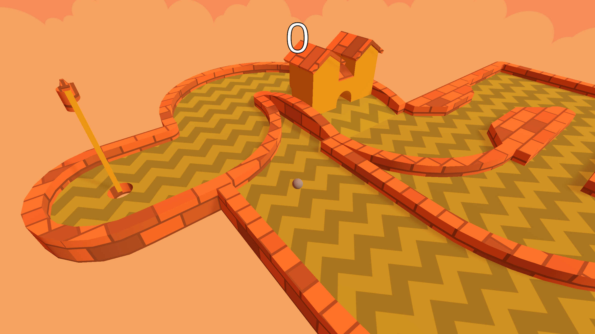

# Golf - try this game [here!](https://gitmanik.dev/golf)

## Description

Simple Golf minigame I made a couple years ago and finally decided to polish and publish.

Game currently has 4 levels which were created by using [Asset Forge](https://kenney.nl/tools/asset-forge)

### Technology Stack
- **Game Engine:** Unity 6 (6000.0.38f1)
- **Graphics:** 
  - [Kenney Minigolf Kit](https://kenney.nl/assets/minigolf-kit)
  - [Farland Skies](https://assetstore.unity.com/packages/2d/textures-materials/sky/farland-skies-cloudy-crown-60004#reviews)
- [Better Minimal WebGL Template](https://seansleblanc.itch.io/better-minimal-webgl-template)
